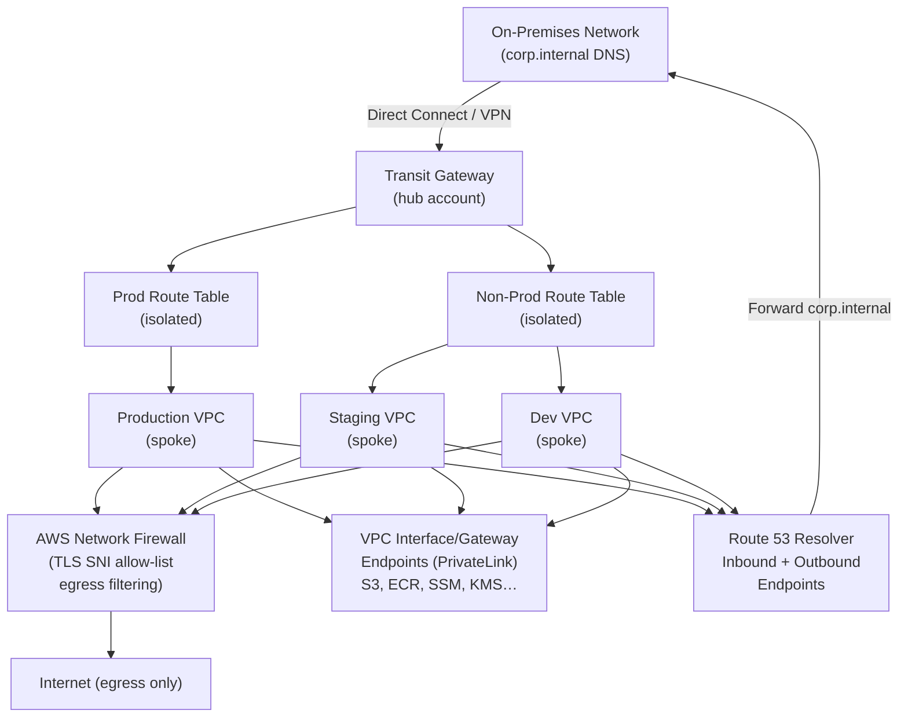

# aws-networking-hub

[](https://github.com/shivajichaprana/aws-networking-hub/actions/workflows/ci.yml)
[](LICENSE)
[](https://developer.hashicorp.com/terraform)

Transit Gateway hub-and-spoke networking for AWS multi-account environments with PrivateLink cost optimisation, hybrid on-prem DNS, and Network Firewall egress filtering.

---

## Architecture



### Design Principles

| Principle | Implementation |
|-----------|----------------|
| **Blast-radius isolation** | Prod and non-prod VPCs in separate TGW route tables; no cross-talk unless explicitly allowed |
| **Zero NAT Gateway cost for AWS APIs** | PrivateLink Interface/Gateway endpoints for S3, ECR, SSM, KMS, Secrets Manager, STS, CloudWatch Logs |
| **Egress traffic control** | All outbound internet via Network Firewall; TLS SNI allow-list and malicious domain block-list |
| **Hybrid DNS** | Route 53 Resolver forwards `corp.internal` to on-prem DNS; PHZs shared to all spokes |
| **Single pane of glass** | All routing changes via Transit Gateway — no per-VPC peering mesh to maintain |

---

## Module Reference

### `terraform/modules/tgw`

Creates the Transit Gateway hub with two isolated route tables (prod / non-prod).

| Input | Type | Required | Description |
|-------|------|----------|-------------|
| `name` | `string` | ✅ | Name prefix for TGW resources |
| `amazon_side_asn` | `number` | ✅ | BGP ASN (must be in private range 64512-65534) |
| `environment_tags` | `map(list(string))` | ✅ | Map of environment → list of VPC IDs to associate with each route table |
| `tags` | `map(string)` | — | Additional resource tags |

Key outputs: `tgw_id`, `tgw_arn`, `route_table_ids`

---

### `terraform/modules/vpc-spoke`

Provisions a spoke VPC with public, private, and TGW-attachment subnets plus automatic TGW attachment.

| Input | Type | Required | Description |
|-------|------|----------|-------------|
| `name` | `string` | ✅ | Spoke VPC name |
| `vpc_cidr` | `string` | ✅ | CIDR block for the VPC (e.g. `10.10.0.0/16`) |
| `tgw_id` | `string` | ✅ | Transit Gateway ID to attach to |
| `tgw_route_table_id` | `string` | ✅ | TGW route table to associate this spoke with |
| `availability_zones` | `list(string)` | ✅ | AZs to provision subnets in |
| `enable_internet_gateway` | `bool` | — | Create IGW for public subnets (default `false`) |
| `tags` | `map(string)` | — | Additional resource tags |

Key outputs: `vpc_id`, `private_subnet_ids`, `tgw_attachment_id`

---

### `terraform/modules/privatelink`

Creates Interface and Gateway VPC endpoints to eliminate NAT Gateway costs for AWS service traffic.

**Interface endpoints included:** ECR API, ECR DKR, STS, KMS, Secrets Manager, SSM, SSM Messages, CloudWatch Logs, CloudWatch Monitoring, Lambda, EC2 Messages

**Gateway endpoints included:** S3, DynamoDB

| Input | Type | Required | Description |
|-------|------|----------|-------------|
| `name` | `string` | ✅ | Name prefix |
| `vpc_id` | `string` | ✅ | VPC to place endpoints in |
| `subnet_ids` | `list(string)` | ✅ | Private subnets for interface endpoints |
| `route_table_ids` | `list(string)` | ✅ | Route tables for gateway endpoints |
| `enabled_interface_endpoints` | `list(string)` | — | Override list of interface endpoints to create |
| `tags` | `map(string)` | — | Additional resource tags |

Key outputs: `endpoint_ids`, `endpoint_dns_names`

---

### `terraform/modules/dns-hybrid`

Sets up Route 53 Resolver inbound/outbound endpoints and forwarding rules for hybrid DNS.

| Input | Type | Required | Description |
|-------|------|----------|-------------|
| `name` | `string` | ✅ | Name prefix |
| `vpc_id` | `string` | ✅ | VPC to place resolver endpoints in |
| `subnet_ids` | `list(string)` | ✅ | Private subnets for resolver ENIs |
| `on_prem_dns_servers` | `list(string)` | ✅ | IP addresses of on-prem DNS resolvers |
| `forward_domains` | `list(string)` | ✅ | DNS domains to forward on-prem (e.g. `["corp.internal"]`) |
| `spoke_vpc_ids` | `list(string)` | — | VPC IDs to share PHZ associations to |
| `tags` | `map(string)` | — | Additional resource tags |

Key outputs: `inbound_endpoint_id`, `outbound_endpoint_id`, `resolver_rule_ids`

---

### `terraform/modules/network-firewall`

Deploys AWS Network Firewall with stateful TLS SNI allow-list and malicious domain block-list rules, plus alert/flow logging.

| Input | Type | Required | Description |
|-------|------|----------|-------------|
| `name` | `string` | ✅ | Name prefix |
| `vpc_id` | `string` | ✅ | VPC to place the firewall in |
| `subnet_ids` | `list(string)` | ✅ | Firewall subnets (one per AZ) |
| `allowed_domains` | `list(string)` | ✅ | TLS SNI domains allowed for egress |
| `blocked_domains` | `list(string)` | — | Known-bad domains to explicitly block |
| `log_retention_days` | `number` | — | CloudWatch log retention (default `30`) |
| `log_bucket_arn` | `string` | — | S3 bucket ARN for flow/alert logs |
| `tags` | `map(string)` | — | Additional resource tags |

Key outputs: `firewall_id`, `firewall_arn`, `endpoint_ids`

---

## Quick Start

### 1. Provision the hub (Transit Gateway)

```hcl
module "tgw" {
  source = "github.com/shivajichaprana/aws-networking-hub//terraform/modules/tgw"

  name            = "main-hub"
  amazon_side_asn = 64512

  environment_tags = {
    prod    = ["vpc-aaaa0000000000001"]   # prod spoke VPC IDs
    nonprod = ["vpc-bbbb0000000000002",   # staging / dev VPC IDs
               "vpc-cccc0000000000003"]
  }

  tags = { Environment = "hub" }
}
```

### 2. Attach a spoke VPC

```hcl
module "prod_spoke" {
  source = "github.com/shivajichaprana/aws-networking-hub//terraform/modules/vpc-spoke"

  name                 = "prod"
  vpc_cidr             = "10.10.0.0/16"
  tgw_id               = module.tgw.tgw_id
  tgw_route_table_id   = module.tgw.route_table_ids["prod"]
  availability_zones   = ["us-east-1a", "us-east-1b", "us-east-1c"]
}
```

### 3. Add PrivateLink endpoints

```hcl
module "endpoints" {
  source = "github.com/shivajichaprana/aws-networking-hub//terraform/modules/privatelink"

  name             = "prod"
  vpc_id           = module.prod_spoke.vpc_id
  subnet_ids       = module.prod_spoke.private_subnet_ids
  route_table_ids  = module.prod_spoke.private_route_table_ids
}
```

### 4. Enable egress filtering

```hcl
module "egress_firewall" {
  source = "github.com/shivajichaprana/aws-networking-hub//terraform/modules/network-firewall"

  name       = "prod-egress"
  vpc_id     = module.prod_spoke.vpc_id
  subnet_ids = module.prod_spoke.firewall_subnet_ids

  allowed_domains = [
    ".amazonaws.com",
    ".docker.io",
    ".ghcr.io",
    "quay.io",
  ]
}
```

See [`examples/onboard-spoke/`](examples/onboard-spoke/) for a complete working example.

---

## Prerequisites

- Terraform >= 1.5
- AWS provider >= 5.0
- AWS account(s) with permissions for VPC, TGW, Route 53, Network Firewall, and VPC Endpoint APIs
- For multi-account: Transit Gateway Resource Access Manager (RAM) sharing enabled

---

## Repository Layout

```
.
├── terraform/
│   ├── main.tf                   # Root module wiring all sub-modules
│   ├── variables.tf
│   ├── outputs.tf
│   ├── versions.tf
│   └── modules/
│       ├── tgw/                  # Transit Gateway hub
│       ├── vpc-spoke/            # Spoke VPC template
│       ├── privatelink/          # VPC Interface + Gateway endpoints
│       ├── dns-hybrid/           # Route 53 Resolver hybrid DNS
│       └── network-firewall/     # AWS Network Firewall egress
├── examples/
│   └── onboard-spoke/            # Full working example
├── docs/
│   ├── architecture.md           # Detailed design decisions
│   ├── onboarding-new-spoke.md   # Step-by-step spoke onboarding runbook
│   └── privatelink-guide.md      # PrivateLink cost analysis
├── .github/
│   └── workflows/
│       └── ci.yml                # Terraform fmt/validate + tflint + checkov + tfsec
├── Makefile
├── CONTRIBUTING.md
└── LICENSE
```

---

## CI / CD

The CI pipeline (`.github/workflows/ci.yml`) runs on every push and PR:

| Job | Tool | What it checks |
|-----|------|----------------|
| `terraform-fmt` | `terraform fmt` | Consistent formatting across all modules |
| `terraform-validate` | `terraform validate` | Each module validates independently |
| `tflint` | tflint v0.50 | AWS-provider best-practice linting |
| `checkov` | Checkov | 1000+ Terraform security policies |
| `tfsec` | tfsec | Static analysis for MEDIUM+ severity findings |
| `docs-lint` | bash | Every module has a `variables.tf` |

All jobs must pass before the `ci-gate` job succeeds.

---

## Security Considerations

- **Route table isolation**: Prod VPCs cannot communicate with non-prod VPCs by default. Cross-environment traffic requires an explicit static route in the TGW route table.
- **Egress filtering**: All internet-bound traffic passes through Network Firewall. The default-deny posture requires explicit allow rules for each destination domain.
- **No public NAT for AWS APIs**: PrivateLink keeps AWS API traffic on the private network, eliminating one class of data-exfiltration risk.
- **Hybrid DNS forward-only**: The Route 53 Resolver only forwards specified domains on-prem; all other queries resolve via Route 53 public resolvers.

---

## Contributing

See [CONTRIBUTING.md](CONTRIBUTING.md) for development setup, module conventions, and the PR checklist.

---

## License

MIT — see [LICENSE](LICENSE).
